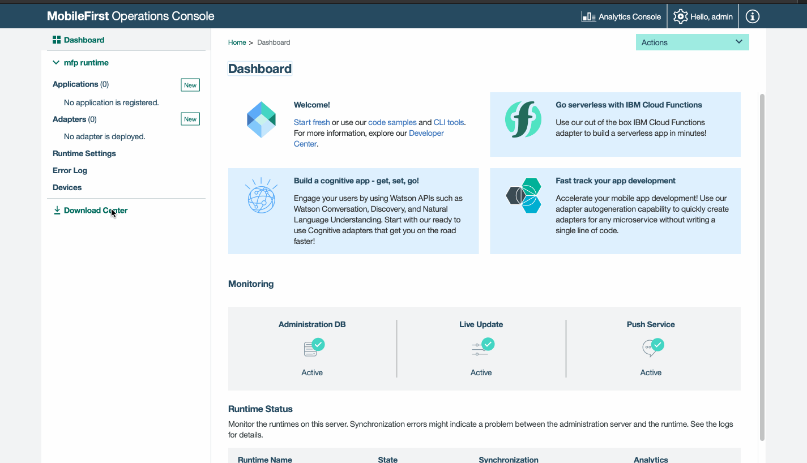
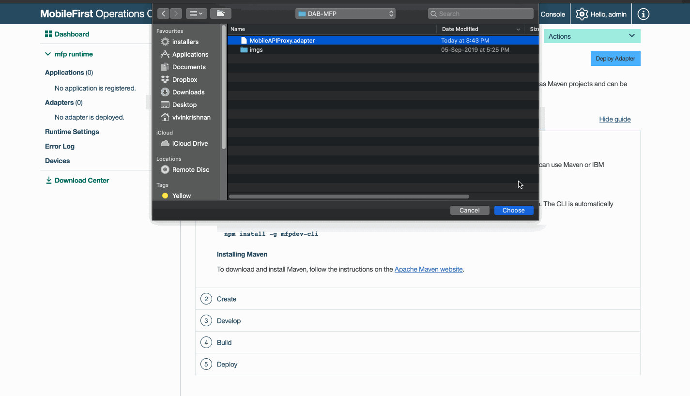
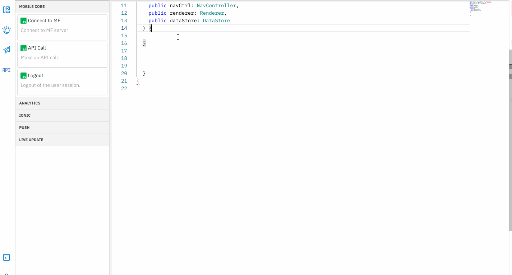

## Invoke a microservice via APIProxy

With APIProxy, you can invoke any backend microservices by defining the endpoint in the APIProxy ( an API project deployed in MFP server). To invoke another microservice, you need only set and save the new backend details in the APIProxy. Unlike an adapter, you need not redeploy. 

### Open an app

1. Open an application that was exported from Design mode, or previously created in Code mode. Click **Open new app** icon. 

    

### Enable APIProxy
    
1. From the Download Center, download the MobileAPIProxy.adapter.

	

2. Deploy the MobileAPIProxy.adapter.

	
    
3. Go to "weatherlist" page. Add code to make an API call.

	

4. Modify the code snippet to point to the APIProxy endpoint defined.

   >Note: Note that you do not have to specify the complete backend URI or the relative path with respect to MFP adapters. 
		
	```javascript
	cities;
	weatherData = {
	    weather: '',
	    temperature: '',
	    wind: '',
	    visibility: '',
	    icon: ''
	};

	onCitySelect() {
		this.callWeatherService();
	}
	
	callWeatherService() {
		var self = this;
		var resourceRequest = new WLResourceRequest(
		    '/weather',
		    WLResourceRequest.GET,
		    {useAPIProxy: true}
		);
		
		resourceRequest.setQueryParameter('selectedCity', this.cities);
		resourceRequest.send().then(
		  function(response) {
		     // alert('Success: ' + response.responseText);
		     self.ngZone.run(() => {
		       var responseJSON = JSON.parse(response.responseText);
		       self.weatherData.weather = responseJSON.current_observation.icon;
		       self.weatherData.temperature =
		       responseJSON.current_observation.temperature_string;
		       self.weatherData.wind = responseJSON.current_observation.wind_string;
		       self.weatherData.visibility =
		       responseJSON.current_observation.visibility_mi;
		       self.weatherData.icon = responseJSON.current_observation.icon_url;
		        });
		      },
		      function(response) {
		        alert('Failure: ' + JSON.stringify(response));
		      }
		    );
	}
	
	reserver() {
		    //Import the Resortslistpage for this redirection to work:
		    //Add: import { ResortslistPage } from '../resortslist/resortslist';
		    this.navCtrl.push(ResortslistPage);
	}
	```
	    	
5. Modify the "weatherlist" html page to render the response.Add the following snippet with *ion-content* tags:		
	
	```javascript
	<h4>Pick a City</h4>
  	<ion-select [(ngModel)]="cities" (ionChange)="onCitySelect()">
     <ion-option value="Las_Vegas">Las Vegas</ion-option>
     <ion-option value="Miami">Miami</ion-option>
     <ion-option value="Paris">Paris</ion-option>
     <ion-option value="Cork">Cork</ion-option>
     <ion-option value="San_Francisco">San Francisco</ion-option>
     <ion-option value="Barcelona">Barcelona</ion-option>
   </ion-select>

   <ion-card>
	    
	    <ion-card-content>
	      <ion-card-title>
	        {{cities}}
	      </ion-card-title>
	      <p>
	        Temperature : {{weatherData.temperature}}
	      </p>
	      <p>
	        Wind : {{weatherData.wind}}
	      </p>
	      <p>
	        visibility : {{weatherData.visibility}}
	      </p>
	    </ion-card-content>
    </ion-card>
   <button ion-button (click)="reserver()">View Resorts</button>
	
	```
	 
		
5. Run the application on a device or emulator to see the response.

---------------

Let us engage with end users via [Push notifications](../push-notifications) now
